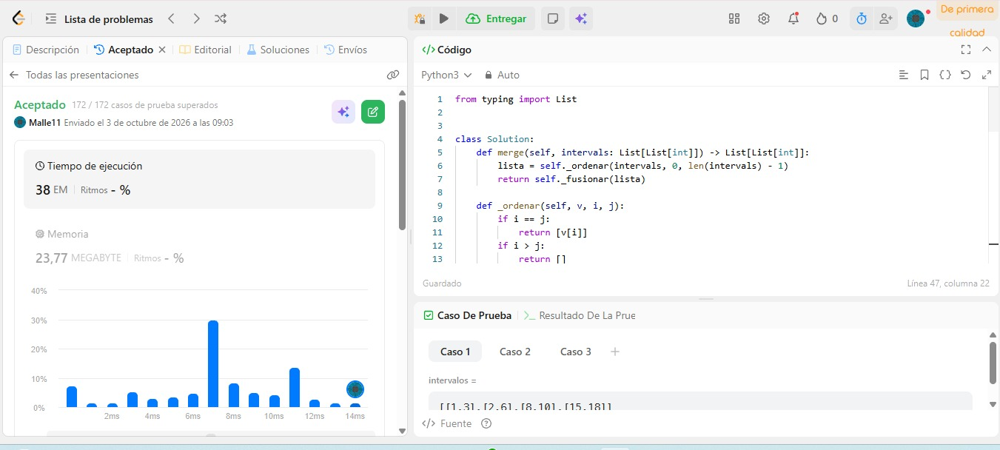
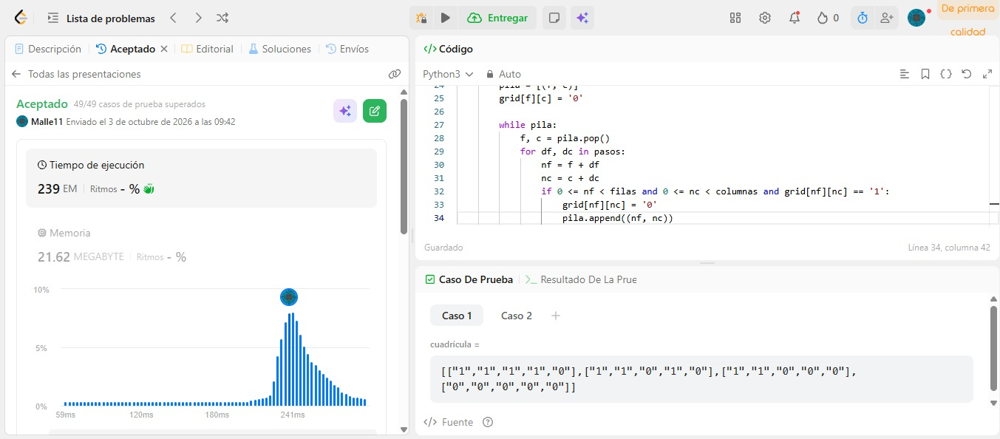
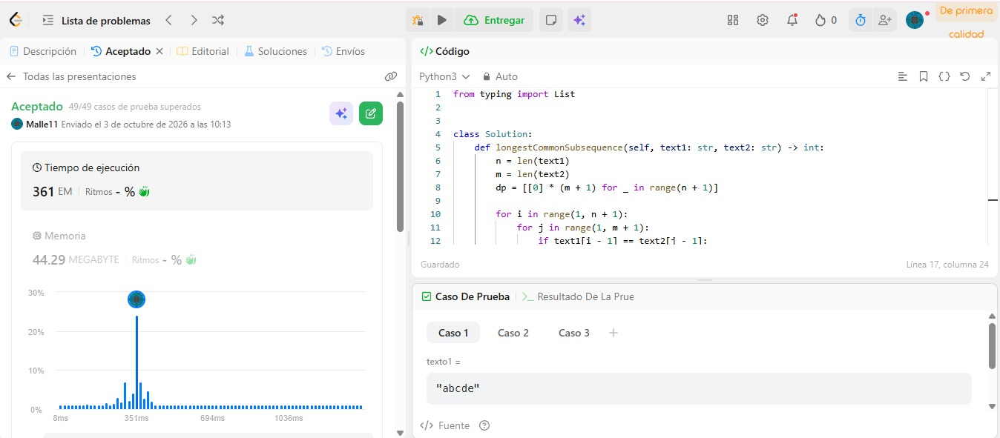
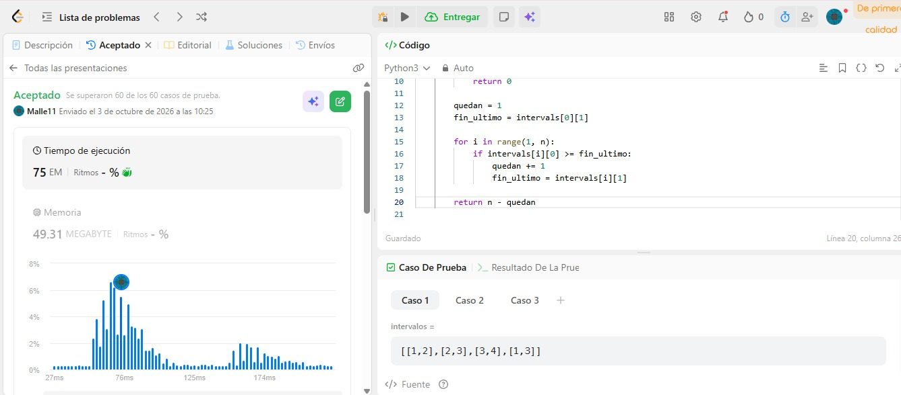
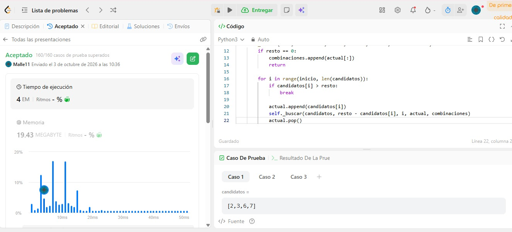

# Cinco familias en LeetCode

**Curso:** Análisis de algoritmos · ITM · 2026-2
**Lenguaje:** Python 3
**Cuenta de LeetCode:** la misma con la que se hizo *Submit* en cada problema (ver las evidencias).

Los cinco ejercicios se resuelven **uno por uno**, cada uno con la familia que pide el enunciado:
ordenamiento, grafos, programación dinámica, greedy y backtracking. En cada caso el algoritmo
está implementado a mano (no se llama a `sort()` de la librería donde el ejercicio **es** el
ordenamiento, ni se hace backtracking sin retractarse, ni se pega código que no se pueda explicar).

Cada ejercicio vive en una carpeta nombrada por su **familia**, y el archivo se llama como el
problema, para que quede claro cuál es cuál.

```
Tarea 5/
├── README.md
├── Ordenamiento/              ← ejercicio 1 · ordenamiento
│   └── merge_intervals.py
├── Grafos/                    ← ejercicio 2 · grafos
│   └── number_of_islands.py
├── programación dinámica/      ← ejercicio 3 · programación dinámica
│   └── longest_common_subsequence.py
├── greedy/                     ← ejercicio 4 · greedy
│   └── non_overlapping_intervals.py
├── backtracking/                ← ejercicio 5 · backtracking
│   └── combination_sum.py
└── evidencias/                 ← capturas Accepted (una por problema)
```

| # | Problema | Familia | Carpeta del código | Evidencia |
| --- | --- | --- | --- | --- |
| 1 | [56. Merge Intervals](https://leetcode.com/problems/merge-intervals/) | Ordenamiento | [`Ordenamiento/merge_intervals.py`](Ordenamiento/merge_intervals.py) | [Accepted](evidencias/merge-intervals-accepted.jpeg) |
| 2 | [200. Number of Islands](https://leetcode.com/problems/number-of-islands/) | Grafos | [`Grafos/number_of_islands.py`](Grafos/number_of_islands.py) | [Accepted](evidencias/number-of-islands-accepted.jpeg) |
| 3 | [1143. Longest Common Subsequence](https://leetcode.com/problems/longest-common-subsequence/) | Programación dinámica | [`programación dinámica/longest_common_subsequence.py`](programación%20dinámica/longest_common_subsequence.py) | [Accepted](evidencias/longest-common-subsequence-accepted.jpeg) |
| 4 | [435. Non-overlapping Intervals](https://leetcode.com/problems/non-overlapping-intervals/) | Greedy | [`greedy/non_overlapping_intervals.py`](greedy/non_overlapping_intervals.py) | [Accepted](evidencias/non-overlapping-intervals-accepted.jpeg) |
| 5 | [39. Combination Sum](https://leetcode.com/problems/combination-sum/) | Backtracking | [`backtracking/combination_sum.py`](backtracking/combination_sum.py) | _pendiente_ |

---

## 1. 56. Merge Intervals

**Problema:** [56. Merge Intervals](https://leetcode.com/problems/merge-intervals/) · Medium
**Familia:** ordenamiento (merge sort) + una pasada lineal de fusión
**Código:** [`Ordenamiento/merge_intervals.py`](Ordenamiento/merge_intervals.py)

### Idea en dos frases

Se elige como **clave el extremo izquierdo** (`start`) y se ordena el arreglo de intervalos con
un **merge sort propio** (divide y vencerás por mitades), no con el `sort()` de la librería;
después, sobre la corrida ya ordenada, **una sola pasada de izquierda a derecha** mantiene el
intervalo "abierto" que es el último de `salida`: si el siguiente empieza antes o justo cuando
termina (`inicio <= salida[-1][1]`), se **ensancha** el `end`; si no, se **cierra** y se abre otro.

### Por qué una sola pasada basta (la justificación que se pide)

Después de ordenar por `start`, los inicios son no decrecientes. Al llegar al intervalo
`[inicio, fin]`:

- Si `inicio <= salida[-1][1]`, ambos se solapan (o se tocan) y su unión es
  `[salida[-1][0], max(salida[-1][1], fin)]`. Como el intervalo abierto ya está ordenado y es el
  último, solo hay que **subir el `end`**.
- Si `inicio > salida[-1][1]`, entonces el intervalo abierto **ya no puede crecer más**: ningún
  intervalo que venga después puede empezar por debajo de `inicio > salida[-1][1]`, así que
  ninguno lo solapa. Se puede **cerrar** de una vez y abrir el siguiente.

Por eso no hace falta repetir la pasada ni comparar todos contra todos (lo que sería O(n²)).

### Lo que NO es la solución

- No se concatenan los extremos sueltos y se ordenan esos números: aquí se ordenan **intervalos
  enteros** por su inicio, y la fusión se hace sobre la corrida de intervalos ya ordenada.
- No se usa `intervals.sort(key=...)` de la librería: el ordenamiento **es parte** del ejercicio,
  por eso `_ordenar` / `_mezclar` están escritos a mano (merge sort de verdad).
- La entrada no se modifica: `_fusionar` solo lee `lista[i]` y crea los intervalos fusionados
  nuevos (`[lista[0][:]]`, `[inicio, fin]`), así que el `intervals` que recibe
  `Solution.merge` queda intacto.

### Complejidad

Con `n = intervals.length` y `k = número de intervalos fusionados` (`k ≤ n`):

- **Tiempo: Θ(n log n).** El merge sort cumple `T(n) = 2·T(n/2) + Θ(n)`, que por el teorema
  maestro da `Θ(n log n)`; la pasada de fusión es solo `Θ(n)`. El término dominante es el
  ordenamiento, no la fusión.
- **Espacio: Θ(n).** La lista `lista` con los `n` intervalos (más `salida` con `k ≤ n`), y la
  recursión del merge sort es `Θ(log n)` de profundidad: en todo momento las listas vivas son
  segmentos disjuntos del arreglo original, así que nunca hay más de `n` intervalos en memoria.

### Evidencia de Accepted



<!-- Evidencia opcional del detalle de runtime/memoria -->
<!--  -->

---

## 2. 200. Number of Islands

**Problema:** [200. Number of Islands](https://leetcode.com/problems/number-of-islands/) · Medium
**Familia:** grafos (DFS iterativo para contar componentes conexas)
**Código:** [`Grafos/number_of_islands.py`](Grafos/number_of_islands.py)

### Modelo: el grafo que está escondido en la grilla

- **Vértice:** cada celda de la grilla que vale `'1'` (la tierra). Las celdas `'0'` (agua) **no son
  vértices**: no entran al grafo.
- **Arista:** dos celdas `'1'` que son vecinas **ortogonales**. Solo hay cuatro posibles:
  arriba `(f-1, c)`, abajo `(f+1, c)`, izquierda `(f, c-1)`, derecha `(f, c+1)`. **La diagonal no
  genera arista**, así que en una grilla `[["1","0"],["0","1"]]` hay dos islas, no una.
- **No dirigido:** la arista es simétrica: si `u` es vecina de `v`, entonces `v` es vecina de
  `u`. No hay pesos ni sentidos.
- **Componente conexa:** una isla es exactamente una componente conexa de ese grafo. Por eso
  "contar islas" **es** "contar componentes conexas", que es el problema clásico de grafos (la
  tarea 3 lo pedía con matriz de adyacencia; acá el grafo es implícito y la arista se calcula
  con la regla de los cuatro vecinos).

### Idea en dos frases

Se recorre la grilla celda por celda; cada vez que aparece un `'1'` que todavía no fue marcado,
se **suma 1 al contador** (esa celda es la semilla de una isla nueva) y se lanza un **DFS** que
**hunde** toda su componente, cambiando cada `'1'` alcanzado a `'0'`. Cuando el DFS termina, toda
esa isla quedó marcada, así que ninguna otra celda de la misma isla volverá a contarse.

El marcado se hace **al apilar** (`grid[nf][nc] = '0'` antes del `append`), no al desapilar: si se
marcara al desapilar, la misma celda podría entrar dos veces en la pila y se contaría dos veces.

### Por qué el contador coincide con el número de islas

- Al encontrar una semilla `'1'` no marcada, el DFS visita **exactamente** su componente conexa
  (el conjunto de celdas alcanzables por aristas, que es la definición de isla) y la marca toda.
- Como la componente queda completamente marcada, **ninguna** celda de esa isla puede volver a
  ser semilla. Cada isla aporta entonces **una y exactamente una** unidad al contador.
- El doble `for` recorre todas las celdas, así que **toda** isla tiene alguna celda que será
  semilla: no se deja ninguna sin contar.

### DFS iterativo, no recursivo

El DFS usa una **pila explícita** en vez de llamadas recursivas a propósito: el caso máximo de
LeetCode es `300 × 300 = 90 000` celdas, y la recursión de Python tiene un límite de profundidad
cercano a 1000, así que una versión recursiva lanzaría `RecursionError` en las pruebas grandes. La
pila explícita recorre **la misma componente**, solo que el "estado pendiente" vive en una lista.

Alternativas que también valen (no usadas aquí): **BFS** con una cola (`collections.deque`), o
**Union-Find** uniendo cada `'1'` con su vecino de abajo y de la derecha y contando raíces al final.

### Complejidad

Con `m = número de filas` y `n = número de columnas`:

- **Tiempo: Θ(m · n).** El doble `for` examina las `m · n` celdas una vez (Θ(mn)). Además, cada
  celda de tierra entra en la pila **una sola vez** (porque se marca al apilarla), y cada entrada
  a la pila hace solo 4 chequeos de vecino en tiempo O(1): la suma de todos los DFS juntos es
  Θ(#celdas '1') ≤ Θ(mn). No hay reprocesamiento ni comparaciones entre islas.
- **Espacio: O(m · n) en el peor caso** — la pila del DFS. En el caso extremo de una isla que
  cubre toda la grilla, la pila llega a Θ(mn) entradas. Fuera de la pila solo O(1) (los dos
  índices del `for` y las tuplas de los 4 pasos).

El marcado **no usa una matriz extra de visitados**: se reutiliza la propia grilla, porque
LeetCode permite modificarla (el enunciado no exige conservar el tablero). Así el espacio se
mantiene en el orden de la pila y no en Θ(mn) adicionales.

### Evidencia de Accepted



<!-- Evidencia opcional del detalle de runtime/memoria -->
<!--  -->

---

## 3. 1143. Longest Common Subsequence

**Problema:** [1143. Longest Common Subsequence](https://leetcode.com/problems/longest-common-subsequence/) · Medium
**Familia:** programación dinámica (tabla de prefijos, estilo Needleman–Wagner / Wagner–Fischer)
**Código:** [`programación dinámica/longest_common_subsequence.py`](programación%20dinámica/longest_common_subsequence.py)

Es el **LCS de Needleman–Wagner / Wagner–Fischer**: una tabla donde cada casilla guarda el resultado
de un subproblema —un par de prefijos— y cada casilla se calcula a partir de las que están arriba, a
la izquierda y en la diagonal. Es **subsecuencia** (se pueden borrar letras, el orden no cambia), no
subcadena: `"ace"` es subsecuencia de `"abcde"` y da 3, mientras que `"aec"` **no** lo es.

### Estado

`dp[i][j]` = **longitud de la subsecuencia común más larga entre `text1[0..i)` y `text2[0..j)`**.

Los corchetes son medio abiertos: `text1[0..i)` son las **`i` primeras letras** de `text1`, o sea
`text1[0], text1[1], ..., text1[i-1]`. Por eso el último carácter de ese prefijo es `text1[i-1]`, y
por eso la respuesta final está en `dp[n][m]`, no en `dp[n-1][m-1]`.

### Casos base

- `dp[0][j] = 0` para toda `j`: el prefijo de `text1` de largo 0 está vacío, y una subsecuencia
  común con algo vacío tiene longitud 0.
- `dp[i][0] = 0` para toda `i`: igual por el otro lado, el prefijo de `text2` está vacío.

Son las dos **fronteras** de la tabla: por eso la matriz se crea con `n + 1` filas y `m + 1`
columnas (una fila y una columna extra para poder tener esos ceros).

### Recurrencia

Para `i ≥ 1` y `j ≥ 1`, mirando los **últimos caracteres** de cada prefijo:

```
si text1[i-1] == text2[j-1]:
    dp[i][j] = 1 + dp[i-1][j-1]
si no:
    dp[i][j] = max(dp[i-1][j], dp[i][j-1])
```

**Por qué si coinciden se usan los dos:** hay un intercambio clásico — si los últimos caracteres
son iguales, existe una solución óptima que los empareja a los dos (si no, se puede recolocar el
emparejamiento sin cambiar la longitud). Entonces se resuelve el problema de los prefijos que
quedan, `dp[i-1][j-1]`, y se le suma 1 letra.

**Por qué si no coinciden hay que=max(...):** los dos últimos caracteres no pueden estar emparejados
entre sí (son distintos), así que la solución tiene que **descartar al menos uno de los dos**. Solo
hay dos opciones: descartar el de `text1` (`dp[i-1][j]`) o descartar el de `text2` (`dp[i][j-1]`),
y la mejor de las dos es el máximo.

### Por qué se puede llenar la tabla sin recursión

La recurrencia solo mira `dp[i-1][j-1]`, `dp[i-1][j]` y `dp[i][j-1]`: **la fila `i-1` y la columna
`j-1`**. Recorriendo `i` de 1 a `n` y dentro `j` de 1 a `m` (orden por filas), cuando se calcula
`dp[i][j]` las tres casillas de las que depende **ya están calculadas**. Ese es el orden topológico
de la recurrencia, y por eso no hace falta recursión ni memorizar nada: es la **tabulación** pura.

Lo que **no** se puede hacer es la recursión sin memo
(`lcs(i, j) = ... lcs(i-1, j) ... lcs(i, j-1)`): como en cada caso distinto aparecen **dos** llamadas
recursivas, el árbol de recursión tiene tamaño **exponencial** (Θ(2ⁿ) en el peor caso) — es el
árbol exponencial de la guía. Con memo pasa a ser Θ(nm), pero la tabulación lo hace directo y sin
guardar nada.

### Por qué un greedy "tomo la primera coincidencia" falla

Ese greedy empareja cada letra de `text1` con la **primera** aparición disponible en `text2`, pero
elegir la aparición más a la izquierda puede **bloquear** una solución más larga. Contraste
obligatorio:

- `text1 = "abcd"`, `text2 = "bcad"`. El greedy arranca emparejando la `a` de `text1` con la `a` de
  `text2` (posición 2); después no quedan ni `b` ni `c` ni `d` después de ese punto, y termina con
  **1** letra. Pero la subsecuencia común más larga es **`"bcd"`**, de longitud **3**. La tabla
  devuelve 3; el greedy, 1. Por eso hay que tabular y no elegir localmente.

### Complejidad

Con `n = len(text1)` y `m = len(text2)`:

- **Tiempo: Θ(n · m).** La tabla tiene `(n + 1)(m + 1)` casillas y cada una se llena con trabajo
  O(1) (una comparación y un `max`). El recorrido es por filas y no hay recursión.
- **Espacio: Θ(n · m)** — la matriz de `(n + 1)(m + 1)` enteros.

Optimización conocida (no necesaria aquí): como `dp[i][j]` solo lee la **fila anterior** y la
**propia fila en la columna anterior**, se puede comprimir a **dos filas** (o a una sola fila
guardando la diagonal en una variable) y bajar el espacio a **Θ(min(n, m))** — se usa la fila del
taller de menor largo. Se dejó la tabla completa a propósito: el estado del enunciado es
`dp[i][j]` y es el que se lee y se explica en la entrega.

### Evidencia de Accepted



<!-- Evidencia opcional del detalle de runtime/memoria -->
<!--  -->

---

## 4. 435. Non-overlapping Intervals

**Problema:** [435. Non-overlapping Intervals](https://leetcode.com/problems/non-overlapping-intervals/) · Medium
**Familia:** greedy (selección de actividades)
**Código:** [`greedy/non_overlapping_intervals.py`](greedy/non_overlapping_intervals.py)

### Idea en dos frases

Es la **selección de actividades de la guía, contada al revés**: maximizar cuántos intervalos caben
sin solaparse es equivalente a minimizar cuántos se borran (`n − los que quedan`). El criterio greedy
es: **ordenar por extremo final y, en cada paso, quedarse con el primer intervalo que no pisa al
último que se aceptó** — es decir, entre los que todavía caben, elegir **el que termina antes**.

### El criterio greedy, paso a paso

1. **Candidatos:** los `n` intervalos, ordenados de menor a mayor `end`
   (`intervals.sort(key=lambda intervalo: intervalo[1])`).
2. **Estado:** `fin_ultimo` = el `end` del último intervalo que se aceptó, y `quedan` = cuántos se
   han aceptado hasta ahora. El primer intervalo ordenado siempre se acepta: `quedan = 1`.
3. **Decisión local (el criterio):** se recorre el resto en orden y se acepta el intervalo
   `[inicio, fin]` **si y solo si `inicio >= fin_ultimo`**. Si `inicio < fin_ultimo`, se solapa con el
   último aceptado y **se cuenta como borrado** (no se acepta). Al aceptar, `fin_ultimo` pasa a ser
   `fin`.
4. **Respuesta:** `n - quedan`, es decir, los que no se eligieron.

El detalle del `>=` es el que hace el enunciado: dos intervalos **que se tocan** (uno arranca
justo cuando el otro termina, como `[1,2]` y `[2,3]`) **no** se solapan y LeetCode los admite
juntos. Por eso la condición de rechazo es `inicio < fin_ultimo` (estricta), no `<=`.

### Por qué el greedy es óptimo (intercambio)

Sea `G` el intervalo con el `end` más pequeño de todos (el primero de la lista ordenada). Sea `Ó`
una solución óptima cualquiera, y sea `I` su primer intervalo.

- `G.end ≤ I.end` porque `G` es el que termina antes.
- Reemplazar `I` por `G` en `Ó`: el resto de los intervalos de `Ó` arrancan en `≥ I.end`, y como
  `G.end ≤ I.end`, todos ellos siguen arrancando **después** de `G`. No se pierde ninguno y no se
  rompe la no-superposición: además `G` no se solapa con nada anterior porque no hay nada anterior.
- El resultado sigue siendo una solución válida **con la misma cantidad de intervalos**.

O sea: **existe** una solución óptima que empieza con `G`. Repetir el argumento sobre lo que
queda (los intervalos que arrancan después de `G.end`) es **inducción** sobre el número de
intervalos, y prueba que la estrategia greedy alcanza el máximo. Como maximize `quedan` es
equivalente a minimize `n − quedan`, el greedy también es óptimo para lo que pregunta el
ejercicio.

**Contraste con el criterio equivocado:** si en vez de "termina antes" se usara "empieza antes",
en `[[1,100], [2,3], [4,5], [6,7]]` se tomaría `[1,100]` y se **descartarían** los otros tres
(respuesta 3). Eligiendo por `end` se aceptan `[2,3]`, `[4,5]`, `[6,7]` y solo se borra `[1,100]`
(respuesta 1, que es el óptimo). El criterio local importa.

### Complejidad

Con `n = intervals.length`:

- **Tiempo: Θ(n log n).** El término dominante es el **ordenamiento** por `end`; el recorrido
  greedy es una sola pasada lineal, Θ(n). El enunciado exige que el greedy quede en O(n log n) y no
  en el DP O(n²) sobre intervalos ordenados (que también sería correcto, pero no es lo evaluado).
- **Espacio: O(n) extra en Python, O(1) del algoritmo en sí.** El greedy solo usa dos variables
  (`quedan` y `fin_ultimo`) más el índice del `for`: Θ(1). Lo que ocupa O(n) es el arreglo temporal
  que reserva `list.sort` de Python (Timsort mezcla bloques y necesita ese buffer), aunque la
  lista `intervals` se reordena **in-place**. La referencia O(1) extra es para un ordenamiento
  in-place tipo `std::sort` de C++; en Python el costo honesto es O(n). No se usa ninguna tabla
  hash ni matriz de DP.

Sobre el `sort` de la librería: aquí **el algoritmo que se evalúa es el greedy**, no el
ordenamiento — el enunciado mismo pide "ordenar por `end`" y analiza el costo del sort. En el
ejercicio 1, en cambio, el ordenamiento **era** el ejercicio, y por eso ahí el merge sort está
escrito a mano.

### Evidencia de Accepted



<!-- Evidencia opcional del detalle de runtime/memoria -->
<!--  -->

---

## 5. 39. Combination Sum

**Problema:** [39. Combination Sum](https://leetcode.com/problems/combination-sum/) · Medium
**Familia:** backtracking (enumeración de combinaciones con retractarse)
**Código:** [`backtracking/combination_sum.py`](backtracking/combination_sum.py)

En Coin Change (tarea 4) la programming dinámica respondía **cuántas** monedas mínimas; acá hay que
**enumerar** todas las combinaciones que suman `target`. Un greedy no sirve porque **no se
retracta**: no hay forma de "deshacer" una elección mala sin volver a explores desde el principio.
El backtracking sí: elige, baja, y al volver **deshace**.

### Estado de la búsqueda

Los tres datos que viaja la recursión (`_buscar`):

- `resto`: **cuánto falta** para llegar a `target` (se lleva el objetivo como resta, no como suma).
- `inicio`: **desde qué índice se puede tomar** el próximo candidato. Es el que garantiza que no
  se repitan permutaciones.
- `actual`: la **combinación parcial** que se está armando (la lista que se va a copiar al final).

### Qué se elige, qué se deshace y qué se poda

1. **Qué se elige:** en el `for i in range(inicio, len(candidatos))` se toma `candidatos[i]`, se
   **agrega** a `actual` y se baja con `resto - candidatos[i]` y **`inicio = i`** (no `i + 1`):
   pasar la misma `i` es lo que permite **reutilizar** ese candidato tantas veces como haga falta,
   que es la regla del problema ("un número puede usarse las veces que quiera").
2. **Qué se deshace (el backtrack):** al volver del llamado recursivo se hace `actual.pop()`. Ese
   `pop` es **todo** el backtracking: deshace la elección, devuelve `actual` al estado que tenía
   antes de elegir, y el `for` sigue probando el siguiente candidato. Sin ese `pop` las
   combinaciones se irían acumulando unas dentro de otras.
3. **Evitar permutaciones:** como el `for` arranca en `inicio` y al bajar se pasa `i` (nunca un
   índice menor), los índices solo crecen. Así `[2,2,3]` se genera una sola vez y `[2,3,2]` **no**
   se genera nunca: es imposible volver a un índice ya pasado.
4. **Podas (dos):**
   - `if candidatos[i] > resto: break` — si el candidato actual ya se pasa del resto, **se corta
     toda la rama**: como `candidatos` está ordenado, todos los siguientes son ≥ que él y tampoco
     caben. El `break` (y no `continue`) depende de que la lista esté ordenada.
   - `if resto == 0: return` — se llegó al objetivo: se copia `actual[:]` (una **copia**, porque si
     se guardara la lista y se siguiera mutando, todas las respuestas saldrían idénticas) y se
     corta la rama.

### Complejidad

Con `n = candidates.length`, `t = target` y `c = min(candidates)`:

- **Profundidad:** cada nivel baja el `resto` por al menos `c`, así que la recursión baja a lo sumo
  `d = ⌊t / c⌋` niveles.
- **Tiempo: exponencial en la profundidad — O(n^(t/c)) en el peor caso.** El árbol de búsqueda no
  es un árbol binario como el de la recursión de LCS: en cada nivel se prueban hasta `n`
  candidatos, y las hojas son combinaciones distintas. El número de nodos del árbol está acotado
  por el número de multiconjuntos de tamaño `≤ d` formados con `n` valores:
  `Σ_{k=0..d} C(n+k-1, k) = C(n+d, d)`, que para `d ≥ n` es `O(n^d) = O(n^(t/c))`. Y como el
  enunciado exige enumerar la lista, esa cola es **inevitable**: el caso de `candidates = [1]` con
  `target` grande tiene una sola salida pero la rama es de profundidad `t`, y el caso peor de
  salida (`candidates = 1..30`, `target = 30`) tiene **5604** combinaciones.
- **Espacio:**
  - **Pila de recursión: Θ(d) = Θ(t/c)** — un marco por nivel.
  - **Combinación parcial `actual`: Θ(d)** — a lo sumo `d` elementos.
  - **Salida: Θ(d · S)** donde `S` = número de soluciones devueltas (cada una con hasta `d`
    elementos). Es inevitable: el enunciado pide la lista.
  - **Espacio auxiliar (sin contar la salida): Θ(t/c)**. No hay tabla de DP ni memoización.

**Contraste con la tarea 4:** el Coin Change es **Θ(n · t)** porque solo necesita un **número**
(el mínimo de monedas). Acá se necesita **la lista completa** de combinaciones, y esa lista
**no** cabe en una tabla de dos dimensiones: un DP que solo cuente (o que arme un óptimo) da un
resultado distinto del que pide el enunciado. Por eso el Θ(n · t) de Coin Change **no** es el
algoritmo de este ejercicio.

### Evidencia de Accepted



<!-- Evidencia opcional del detalle de runtime/memoria -->
<!--  -->